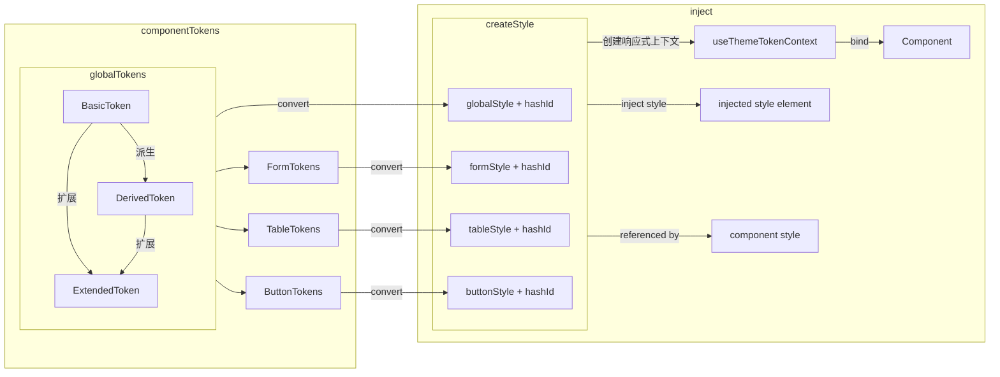

# IDUX2.0做了什么?

IDUX2.0 更新解析和升级指南

---
transition: fade-out
---

# 更新IDUX2.0的原因

<br/>
<br/>

<v-click>

### 历史背景

- 初期无设计师参与，没有构建完整的设计体系
- 设计规范还原度不满足要求
- less变量大量滥用，维护难度大
- 主题定制难度大，基础变量不满足需求
- 将主题的动态切换问题留给了使用者

</v-click>

<v-click>

<br/>
<br/>

### 契机

- 需要支持动态主题
- 安全多产品需要暗黑风格主题

</v-click>

---
transition: fade-out
---

# 变化与目标

- 重视设计系统，重新整理设计Token

- 由组件库提供完整的动态主题功能

---
transition: fade-out
---

# 什么是设计系统？

设计系统是一套由明确设计规范指导的组件库，它可以被广泛复用到系统的设计中，来保证系统设计的一致性。

它包含但不限于以下的基础内容：

- 颜色体系
- 尺寸与间距
- 排版，即字体大小，字重，行间距，行高等
- 文本内容规范，例如错误提示等
- 图标，图片，logo设计
- 无障碍设计

[设计系统相关资料](https://www.invisionapp.com/inside-design/guide-to-design-systems/)

<!-- 1. 不理解设计系统的开发，可能会执迷于还原每一个独立的设计稿，所有的样式都复制粘贴、
2. 理解设计系统，跳出开发思维模式，设计稿只是一个页面的体现
 -->

---
transition: fade-out
---

# 设计系统与普通组件库的区别

<div class="grid pt-4 gap-4 grids-cols-[100px,1fr]">

<p>
没有设计系统支持的组件库更像是小朋友搭积木，虽然能构建出无限可能，但难以保证一致性。
</p>

<p>
有设计系统支撑的组件库，每个组件的使用和组合均有意义，是设计规范的体现，并不是随意的创造。
</p>

</div>

<!-- 作为开发会认为一个组件的API会有无限种可能性，但是结合设计系统，可以大大收敛组件API的设计 -->

---
transition: fade-out
---

# 那么设计系统如何被应用到开发？

<div class="grid pt-4 gap-4 grids-cols-[100px,1fr]">

<p> 单纯的设计规范更像是理论，而实践中我们需要更加具体的规则，需要设计TOKEN。</p>

</div>

---
transition: fade-out
---

# 设计TOKEN 是什么？它怎么工作？

设计TOKEN是一列的规则，它规定了我们在什么场景下使用什么样的颜色、字体，并给这些实际规则命名。

[设计TOKEN相关资料](https://www.invisionapp.com/inside-design/design-tokens/)

<v-click>

## 举例：

我们在设计规范中定义了色板，主题色，以及中性（灰阶）颜色，但实际的设计中我们真的需要所有色板中的颜色吗？

我们可以根据使用场景来给这些颜色附以实际意义，而不是直接引用基础色板。

</v-click>

---
transition: fade-out
---


---
transition: fade-out
---

# IDUX2.0的设计TOKEN

- 多级TOKEN派生设计
  - 基础TOKEN（最基础的一些变量，用于全局或梯度变量的派生）
  - 派生TOKEN（体现设计规范的梯度变量，状态变量等）
  - 扩展TOKEN（实际使用场景应当应用的具体变量）

- 基础算法
  - 色板生成算法
  - 基础色获取
  - 灰阶色

- 内置派生规则，派生变量的计算逻辑

---
transition: fade-out
---


---
transition: fade-out
---

# IDUX2.0的主题设计

### 基于设计TOKEN修改和定制主题

结合 `IxThemeProvider` 和全局配置，通过修改Token变量或预置主题配置来修改或定制主题

### 通过算法设置修改TOKEN的派生和基础色板

不仅可以替换全套token，也可以通过修改算法来定制派生逻辑

### 其他特性

- 基于hash的主题隔离和嵌套
- 主题模块化管理
- js转css变量动态插入

---
transition: fade-out
---

# 如何使用新版本的主题？

```html
<!-- 全局主题注入，非必须 -->
<IxThemeProvider presetTheme="dark">
  <!-- 根应用节点 -->
  <App/>

  <!-- 内部页面嵌套主题 -->
  <IxThemeProvider :tokens="{ global: { colorPrimary: 'purple' } }">
    <SubApp/>
  </IxThemeProvider>
</IxThemeProvider>
```

---
transition: fade-out
---

# Token是如何被引用到样式中的？

<div class="grid pt-4 gap-4 grids-cols-[100px,1fr]">

<p>token 在项目中均为可响应的变量，内部会将变量结合前缀转换成css变量并插入到页面中</p>

<p>组件的样式中引用转换后的css变量</p>

<p>通过脚本将预置的token转换成.css文件，打包时放到dist中</p>

</div>

---
transition: fade-out
---

# 主题隔离怎么实现？如何避免重复的计算？

<div class="grid pt-4 gap-4 grids-cols-[100px,1fr]">

<p>每一组token的键值对结合生成唯一的hash，下次生成的hash如果一致则不再插入新样式</p>

<p>css变量只在hash的class下生效，组件以hash作为class</p>

<p>token分为全局token和组件token，组件token由全局token派生</p>

</div>

---
transition: fade-out
---

# 简易流程图



---
transition: fade-out
---

# 为什么使用ThemeProvider而不是直接用css变量？

<br/>
<br/>

### 优势

<br/>

- 编程语言相对样式有更高的可维护性
- 可以实现复杂的派生算法
- 可以实现主题嵌套和隔离
- 响应式的主题切换功能
- 模块化得定义组件级别主题Token

<br/>
<br/>

### 劣势

<br/>

- 运行时计算需要消耗一部分性能，但几乎可以忽略不记
- 需要编辑器插件实现编写样式时的css变量代码提示

---
transition: fade-out
---

# 回到使用上，业务方可以用它做些什么？

<v-click>

### 我们之前如何定义业务上的主题？

</v-click>

<v-click>

<br/>

在主题css中定义完整的业务css变量？
大量冗余的css变量引用？

</v-click>

<v-click>

<br/>

### 现在可以怎么定义业务主题？

</v-click>

<v-click>

<br/>

- 引用组件库梳理的全局变量
- 每个页面或者子应用模块化定义和注册各自主题变量
- 遵循设计系统和设计TOKEN，实现快速切换主题

</v-click>

---
transition: fade-out
---

# 回到使用上，业务方可以用它做些什么？

<v-click>

<br/>

### 我们之前如何自定义组件样式？

全局样式覆盖？页面内样式覆盖？

</v-click>

<v-click>

<br/>

### 现在可以怎么自定义组件样式？

</v-click>

<v-click>

<br/>

- 使用ThemeProvider嵌套主题功能，局部修改主题变量，更加可控
- 遇到主题变量不包含的自定义内容，提需求新增主题变量

</v-click>

---
transition: fade-out
---

# 如何快速升级？

### 修改组件样式引入方式

将原来的 `seer.full.css`， `reset.seer.css` ，换成 `index.full.css`，`reset.css`等

### 去掉 seerConfig

2.0已经将原先的default主题全部去掉，以seer的规范作为默认主题，不再需要seerConfig

### 移除废弃的API

除了 `IxTag` 的 `color` 配置，其余暂时会在 `beta` 版本保留，但正式版会移除。

### 去除所有组件库 less 变量引用

除了 `@idux-prefix`，其余 less 变量大部分被移除，并不推荐使用

[从V1到V2](https://idux.site/docs/v-1-to-v-2/zh)

---
transition: fade-out
---

# 提问环节

<br/>
<br/>

### 对2.0组件库有什么疑问？需求？

<br/>
<br/>

### 认为有什么不足需要改进？

<br/>
<br/>

### 对设计系统和设计TOKEN以及对开发的意义有什么不理解？